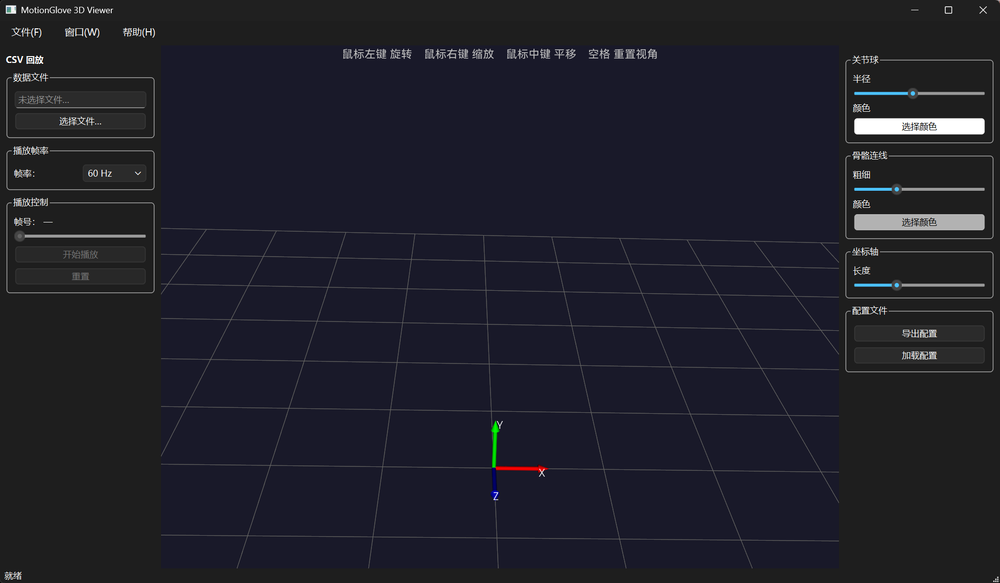
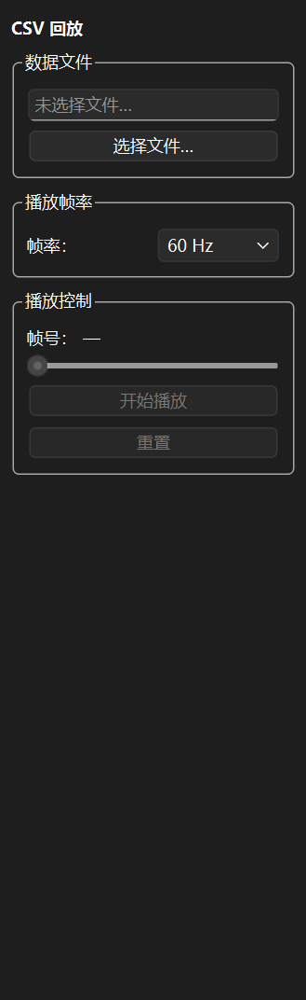
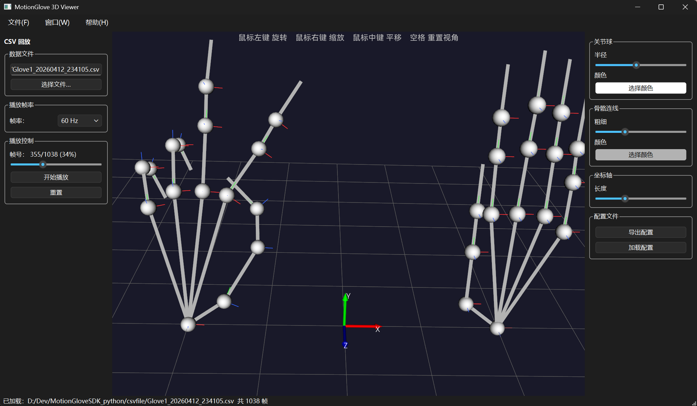

# MotionGlove 3D Viewer — CSV 回放模式使用手册

本文档说明如何使用 **CSV 回放模式**（CSV_PLAYBACK）在无手套硬件的情况下，将已录制的动作数据以 3D 形式回放查看。

---

## 一、准备工作

### 1. 导出 CSV 文件

在 MotionGlove 软件中完成动作录制后，通过软件的导出功能将录制数据保存为 `.csv` 文件，记下文件保存路径。

### 2. 切换到 CSV 回放模式

用文本编辑器打开 `motionGloveSDK_example3_3dView.py`，找到第 54 行左右的以下代码：

```python
APP_MODE = AppMode.UDP_STREAM   # ← 修改此行切换启动模式
```

将其改为：

```python
APP_MODE = AppMode.CSV_PLAYBACK
```

保存文件。

### 3. 启动程序

```bash
python motionGloveSDK_example3_3dView.py
```

程序启动后，窗口左侧显示 **CSV 回放** 面板，右侧显示绘图配置面板，中央为 3D 视口。

---

## 二、界面说明



### 左侧面板 — CSV 回放控制



#### 数据文件

| 控件 | 说明 |
|---|---|
| 文件路径框 | 显示当前已加载文件的完整路径（只读） |
| **选择文件…** 按钮 | 打开系统文件对话框，选择 MotionGlove 导出的 `.csv` 文件 |

选中文件后，程序会立即将全部帧数据加载到内存，状态栏显示文件路径和总帧数，3D 场景跳转到第一帧。

#### 播放帧率

| 控件 | 说明 |
|---|---|
| 帧率下拉框 | 选择回放速度：**10 / 24 / 30 / 60 Hz**，默认 60 Hz |

播放过程中切换帧率立即生效，不会中断播放。

#### 播放控制

| 控件 | 说明 |
|---|---|
| 帧号标签 | 显示当前位置，格式：`当前帧/总帧数 (百分比%)`，未播放时显示 `—` |
| 进度条 | 显示播放进度；拖动可跳转到任意位置 |
| **开始播放 / 暂停播放** 按钮 | 开始或暂停回放；到达末帧后自动变回"开始播放" |
| **重置** 按钮 | 停止播放并回到第一帧 |

---

### 中央视口 — 3D 场景

| 操作 | 功能 |
|---|---|
| 左键拖拽 | 旋转视角 |
| 右键拖拽 | 缩放 |
| 中键拖拽 | 平移 |
| 空格键 | 重置到默认视角 |
| 右键短按 | 弹出上下文菜单 |

**右键菜单选项：**
- 显示 / 隐藏 坐标原点坐标轴
- 显示 / 隐藏 地平面网格（默认显示）
- 重置视角

---

### 右侧面板 — 绘图配置

可实时调整 3D 骨骼的视觉效果，所有修改立即生效。

| 控件 | 说明 |
|---|---|
| 关节球半径 | 滑块调整所有关节球大小（1–10 mm） |
| 关节球颜色 | 点击色块打开取色板，统一修改关节球颜色 |
| 骨骼连线粗细 | 滑块调整骨骼连线粗细（1–30 px，默认 10） |
| 骨骼连线颜色 | 点击色块打开取色板，统一修改骨骼连线颜色 |
| 坐标轴长度 | 滑块调整各关节局部坐标轴的显示长度（1–30 mm） |
| 导出配置 | 将当前参数保存为 JSON 文件，供下次加载使用 |
| 加载配置 | 从 JSON 文件恢复之前保存的参数 |

---

## 三、操作流程



### 基本回放

1. 启动程序（确认 `APP_MODE = AppMode.CSV_PLAYBACK`）
2. 点击左侧 **选择文件…**，在弹出的对话框中选择 `.csv` 文件
3. 等待加载完成（状态栏显示 `已加载：… 共 N 帧`），3D 场景显示第一帧
4. 根据需要在帧率下拉框中选择回放速度
5. 点击 **开始播放**，3D 场景开始逐帧动画
6. 点击 **暂停播放** 可随时暂停，再次点击继续

### 跳转到指定位置

- 在**暂停或播放状态下**，拖动进度条到目标位置
- 松手后 3D 场景立即跳转到该帧并停留（播放状态自动暂停）
- 再次点击 **开始播放** 从该帧继续

### 重新播放

- 点击 **重置** 按钮，或拖动进度条到最左端，然后点击 **开始播放**

### 调整显示效果

- 在任意状态（播放中或暂停）下，直接拖动右侧面板的滑块或点击色块即可实时修改
- 调整满意后点击 **导出配置** 保存，下次启动后点击 **加载配置** 恢复

---

## 四、菜单栏

| 菜单 | 功能 |
|---|---|
| 文件 → 退出 | 关闭程序 |
| 窗口 → 数据面板 | 显示 / 隐藏左侧 CSV 回放面板 |
| 窗口 → 配置面板 | 显示 / 隐藏右侧绘图配置面板 |
| 帮助 → 关于 Qt | 显示 Qt 版本信息 |
| 帮助 → 开源声明 | 显示第三方库许可证信息 |

---

## 五、常见问题

**Q：选择文件后状态栏显示"加载失败"**

文件路径包含特殊字符或文件不是有效的 MotionGlove CSV 格式。请确认文件来源正确，路径中不含中文或特殊字符后重试。

**Q：回放速度与原始录制速度不一致**

在帧率下拉框中选择与录制时一致的帧率（通常为 60 Hz）。

**Q：播放过程中动画卡顿**

文件帧数过多时首次加载需要几秒钟，加载完成后回放流畅。若持续卡顿，尝试降低帧率（如 30 Hz）或减小关节球半径以降低渲染负担。

**Q：3D 场景中看不到手部骨骼**

CSV 文件中可能不含位置数据。确认导出时已勾选位置（pos）和姿态（euler 或 quat）数据项。
