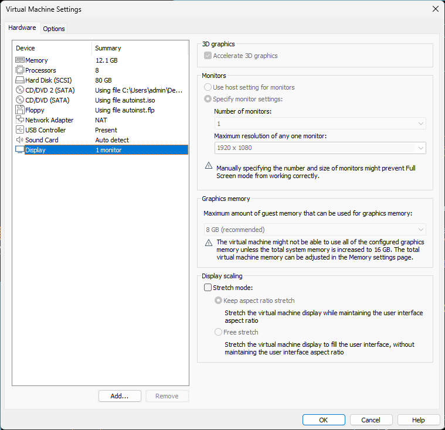
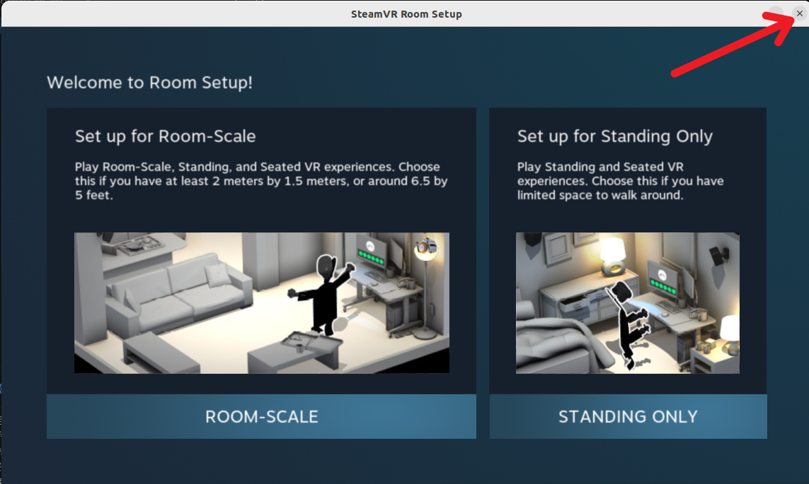
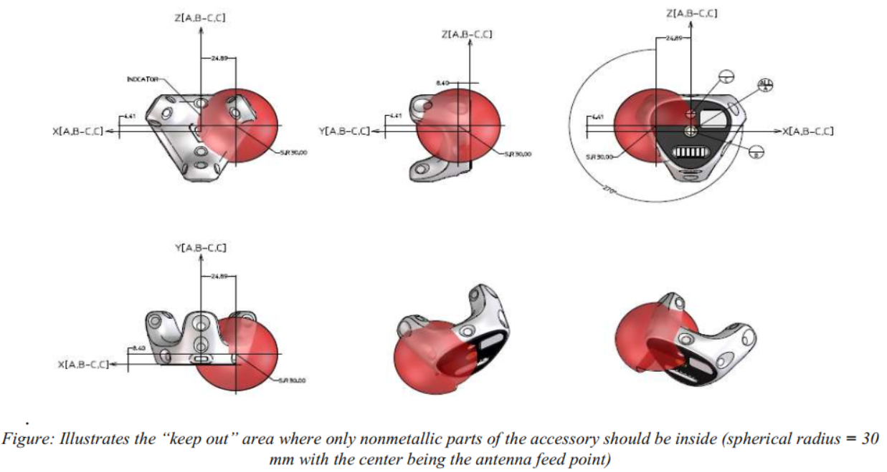

# MotionGloveSDK Python

MotionGlove 动作手套的 Python SDK，通过 UDP 接收手套骨骼数据，接口与 C++ SDK（`motionGloveSDK.h`）保持一致。

---

## 工程结构

```
MotionGloveSDK_python/
│
├── motionGloveSDK_rawReceiver.py      # 原始 UDP 数据接收验证工具
├── motionGloveSDK_example1.py         # 示例1：帧接收计数
├── motionGloveSDK_example2.py         # 示例2：读取左右手掌欧拉角
├── motionGloveSDK_example3_3dView.py  # 示例3：3D 实时可视化（含 UDP_STREAM / CSV_PLAYBACK 双模式）
├── CSV_PLAYBACK_UserManual.md         # CSV 回放模式最终用户操作说明
│
├── src/                               # SDK 内部实现模块
│   ├── __init__.py
│   ├── motionGloveSDK.py              # SDK 主入口（公共接口）
│   ├── definitions.py                 # 数据结构与枚举定义（GloveFrame、BoneIndex 等）
│   ├── glove_frame_assembler.py       # UDP 分包拼帧逻辑
│   ├── decode_glove_csv.py            # CSV 格式骨骼数据解析
│   ├── csv_frame_reader.py            # CsvFrameReader：预加载 CSV 文件，逐帧提供 GloveFrame
│   ├── xsqeconverter.py               # 欧拉角 ↔ 四元数转换（移植自 Movella xsqeconverter.cpp）
│   └── port_occupier.py               # 端口占用诊断工具
│
├── python_draw3d/                     # 3D 渲染辅助模块（基于 VTK）
│   ├── bone_joint_actor.py            # 骨骼关节球体 + 坐标轴 Actor（支持运行时修改半径/颜色/轴长）
│   ├── bone_link_actor.py             # 骨骼连线 Actor（支持运行时修改粗细/颜色）
│   ├── box_actor.py                   # 箱体 Actor
│   ├── camera_control.py              # 摄像机控制（初始化、空格重置视角）
│   ├── draw_config_io.py              # DrawConfig dataclass + JSON 配置读写
│   ├── draw_lines.py                  # 线段绘制工具
│   ├── fps_counter.py                 # FpsCounter：整秒桶计数帧率统计
│   ├── ground_plane.py                # 地平面网格 Actor（灰色，5 cm 间距）
│   ├── overlay_text.py                # 屏幕叠加文字
│   ├── print_help_message.py          # 打印帮助信息
│   └── vtk_axes.py                    # 三坐标轴显示
│
├── libs/                              # 第三方运行时依赖（pip --target 安装到此目录）
│   ├── vtk/                           # VTK 3D 渲染库
│   ├── PIL/                           # Pillow 图像库
│   ├── pyparsing/                     # pyparsing 解析库
│   └── six.py                         # six 兼容库
│
├── triad_openvr/                      # OpenVR 追踪器集成模块（SteamVR 手部追踪支持）
│   ├── triad_openvr.py                # OpenVR 设备发现与控制主类
│   ├── hand_tracker_monitor.py        # 手部追踪器实时监控工具（显示位置/姿态）
│   ├── tracker_cali_manager.py        # 全局追踪器标定偏移管理器
│   ├── tracker_manager.py             # 追踪器数据结构与管理
│   ├── controller_test.py             # 控制器功能测试脚本
│   ├── tracker_test.py                # 追踪器功能测试脚本
│   ├── udp_emitter.py                 # UDP 数据广播工具
│   └── udp_receiver.cs                # C# 示例：UDP 数据接收程序
│
├── config.json                        # OpenVR 全局配置文件（HMD/控制器/追踪器/手部映射）
│
├── docs/                              # 文档文件夹
│   └── CSV_Guide.md                   # CSV 文件加载、回放与转换完整指南
│
├── fonts/
│   └── HarmonyOS_Sans_SC_Regular.ttf  # 中文字体（3D 视图叠加文字使用）
│
├── ui/                                # Qt Designer UI 文件与控制器
│   ├── left_panel.ui                  # 左侧网络信息面板布局（Qt Designer 可编辑）
│   ├── left_panel_widget.py           # LeftPanelWidget 控制器（QUiLoader 运行时加载）
│   ├── csv_import_widget.py           # CsvImportWidget：CSV 回放模式左侧面板
│   ├── draw_config_widget.py          # DrawConfigWidget：右侧绘图配置面板（Slider + 取色板）
│   └── oss_licenses_dialog.py         # 开源声明对话框
│
├── scripts/                           # 实用脚本
│   ├── [Windows]setup_python_libs.cmd # Windows 一键安装依赖脚本
│   ├── [Linux]setup_python_libs.sh    # Linux 一键安装依赖脚本
│   ├── [Windows]build_dist.cmd        # Windows PyInstaller 打包脚本（--console 参数可选）
│   ├── [Linux]build_dist.sh           # Linux PyInstaller 打包脚本（--console 参数可选）
│   ├── [Windows]git_pull_latest.cmd   # Windows 拉取最新代码脚本
│   ├── [Linux]git_pull_latest.sh      # Linux 拉取最新代码脚本
│   ├── [Windows]open_in_vscode.bat    # Windows 用 VSCode 打开工程脚本
│   └── [Linux]open_in_vscode.sh       # Linux 用 VSCode 打开工程脚本
│
└── pyrightconfig.json                 # Pyright 类型检查配置
```

---

## Python 版本要求

**最低要求：Python 3.10**

部分依赖（numpy 2.x、contourpy 1.3.x、kiwisolver 1.4.x）在 Linux 上需要 Python 3.10+；Windows 上建议使用 Python 3.10 或更高版本。

---

## Ubuntu下安装Steam/SteamVR 教程

```
https://github.com/FOHEART/Ubuntu_envConfig/blob/main/Install_SteamVR_Linux/Install_SteamVR_Linux.md
```

## 系统需求

### 硬件要求

运行本程序**需要至少 8 个 CPU 核心和 12 GB 内存**，特别是在需要同时运行 SteamVR 的场景下。这适用于：

- **真机部署**（Windows 或 Linux 物理机）
- **虚拟机运行**（VMware、VirtualBox、Hyper-V 等）

**最低配置：**

| 配置项 | 要求 |
|---|---|
| CPU 核心数 | ≥ 8 核 |
| 内存 | ≥ 12 GB |
| 存储 | ≥ 10 GB（用于依赖库和数据文件） |

**配置不足的影响：**

如果系统配置低于上述要求，特别是在同时运行 SteamVR + 本应用的场景下，会导致：
- 3D 可视化界面帧率过低（< 30 FPS）
- 明显的界面卡顿和响应延迟
- 实时数据处理延迟
- 系统整体运行不稳定

**虚拟机特别说明：**

如果在虚拟机中运行，建议：
- 为虚拟机分配 ≥ 8 个虚拟 CPU（映射到物理核心）
- 分配 ≥ 12 GB 虚拟内存
- 启用 3D 加速（如可用）
- 避免超分配资源（过度分配虚拟 CPU 或内存会导致性能下降）

**虚拟机 3D 显示配置优化（以 VMware 为例）：**

为了获得最佳的 3D 渲染性能，请按以下步骤配置虚拟机的显示设置：



1. **启用 3D 加速**
   - 打开虚拟机设置 → **硬件** 选项卡
   - 选择 **显示** 设备
   - 在右侧 **3D 图形** 部分，勾选 ✓ **加速 3D 图形**
   - 这是运行 VTK 3D 渲染的必要条件

2. **分配图形内存**
   - 在 **显示** 设备的 **图形内存** 部分
   - 将 **分配给虚拟机的最大显存** 设置为 **8 GB**（推荐）或更高
   - **重要提示：** 若要完整使用配置的显存，虚拟机总内存需调整为 ≥ 16 GB
   - 此设置可提升复杂 3D 场景（如包含多个关节球和骨骼连线）的渲染帧率

3. **显示器和分辨率配置**
   - **显示器数量：** 推荐设置为 1 台（简化配置）
   - **最大分辨率：** 建议设置为 **1920 × 1080** 或更高（如 2560 × 1440）
   - 高分辨率可提供更清晰的 3D 骨骼细节展示

4. **显示缩放**
   - **优先选择：** **保持宽高比拉伸** — 在保持宽高比的前提下拉伸虚拟机显示，通常不会导致图像扭曲
   - **备选方案：** **自由拉伸** — 完全填充显示区域（可能导致轻微变形）

**配置后的性能预期：**

| 配置阶段 | CPU | 内存 | 显存 | 预期帧率 |
|---|---|---|---|---|
| 基础配置 | 8 核 | 12 GB | 默认值 | 30~45 FPS |
| 优化配置 | 8 核 | 16 GB | 8 GB | 45~60 FPS |
| 高性能配置 | ≥ 12 核 | 20 GB | 8 GB | ≥ 60 FPS |

**常见问题排查：**

- **显示卡顿（< 30 FPS）：** 检查 3D 加速是否已启用；增加分配的显存或虚拟机内存
- **显示器显示黑屏：** 检查分辨率是否超出虚拟显示适配器的支持范围；尝试降低分辨率或切换缩放模式
- **VTK 渲染崩溃或无法初始化：** 确保 3D 加速已启用；更新虚拟机平台的显卡驱动或工具
- **鼠标输入卡顿：** 增加虚拟 CPU 核心数，或关闭虚拟机中运行的其他 3D 应用

---

## 安装 Python 依赖

运行时依赖统一安装到工程目录下的 `libs/` 文件夹，不污染系统 Python 环境。

### Windows

```cmd
scripts\[Windows]setup_python_libs.cmd
```

### Linux / macOS

```bash
bash scripts/[Linux]setup_python_libs.sh
```

脚本分两步执行：

**第一步** — 将运行时依赖安装到 `libs/` 目录：

| 包 | 版本（Windows） | 版本（Linux） | 用途 |
|---|---|---|---|
| vtk | 9.6.0 | 9.6.0 | 3D 渲染（示例3使用） |
| numpy | 2.4.2 | 2.2.6 | 数值计算 |
| matplotlib | 3.10.8 | 3.10.8 | 绘图（依赖项） |
| Pillow | 12.1.1 | 12.1.1 | 图像处理 |
| pyside6 | 6.5.3 | 6.5.3 | Qt6 GUI 框架（示例3主窗口） |
| pyparsing | 3.3.2 | 3.3.2 | 解析工具 |
| python-dateutil | 2.9.0.post0 | 2.9.0.post0 | 日期工具 |
| packaging | 26.0 | 26.0 | 包管理工具 |
| fonttools | 4.61.1 | 4.62.0 | 字体工具 |
| contourpy | 1.3.3 | 1.3.2 | 等高线（matplotlib 依赖） |
| cycler | 0.12.1 | 0.12.1 | 样式循环（matplotlib 依赖） |
| kiwisolver | 1.4.9 | 1.4.9 | 约束求解（matplotlib 依赖） |
| six | 1.17.0 | 1.17.0 | Python 2/3 兼容层 |

**第二步** — 将开发工具安装到系统 Python：

| 包 | 版本 | 用途 |
|---|---|---|
| pyinstaller | 6.19.0 | 打包为可执行文件 |
| pybind11 | 2.13.6 | Python/C++ 混合编译 |

> **Linux 注意：** numpy 2.4.x、contourpy 1.3.3+、kiwisolver 1.5.0+ 需要 Python 3.11+，Linux 脚本使用了兼容 Python 3.10 的版本。

---

## 快速开始

### 前提条件

1. 打开 MotionGlove 软件，确保手套连接正常
2. 在软件菜单栏 **设置 → 选项 → 插件 → 数据转发** 中确认已添加转发地址 `127.0.0.1:5001`（软件默认已添加）

### 最简使用

```python
from src import motionGloveSDK

motionGloveSDK.MotionGloveSDK_ListenUDPPort(5001)

while True:
    if motionGloveSDK.MotionGloveSDK_isGloveNewFramePending("Glove1"):
        frame = motionGloveSDK.MotionGloveSDK_GetGloveSkeletonsFrame("Glove1")
        motionGloveSDK.MotionGloveSDK_resetGloveNewFramePending("Glove1")
        # 处理 frame ...
```

---

## SDK 公共接口

| 接口 | 说明 |
|---|---|
| `MotionGloveSDK_getVersion()` | 返回 SDK 版本号（32 位整数） |
| `MotionGloveSDK_ListenUDPPort(nPort)` | 绑定本机 UDP 端口并启动后台接收线程，返回 0 成功 / -1 失败 |
| `MotionGloveSDK_CloseUDPPort()` | 关闭 UDP 连接并等待后台线程退出 |
| `MotionGloveSDK_isGloveNewFramePending(actorName)` | 查询指定数据流是否有新帧到达 |
| `MotionGloveSDK_resetGloveNewFramePending(actorName)` | 清除指定数据流的新帧标志 |
| `MotionGloveSDK_GetGloveSkeletonsFrame(actorName)` | 获取最新一帧 `GloveFrame` 骨骼数据 |
| `MotionGloveSDK_GetLastRemoteAddr()` | 返回最近一次收到 UDP 数据包的发送方 `(ip, port)`，未收到数据时返回 `None` |
| `MotionGloveSDK_GetActorNames()` | 返回当前已发现的所有套装名称列表（如 `["Glove1", "Glove2"]`） |

---

## 示例文件说明

### `motionGloveSDK_example1.py` — 帧接收计数

验证 SDK 能否正常接收数据。

- 监听本机 UDP 5001 端口
- 每收到一帧打印帧序号（`[N] New frame received`）
- 正常情况下每秒打印约 60 条记录
- 按 **Enter** 退出

```bash
python motionGloveSDK_example1.py
```

---

### `motionGloveSDK_example2.py` — 读取手掌欧拉角

实时打印左右手掌的三轴欧拉角（Roll/Pitch/Yaw，单位：度）。

- 监听本机 UDP 5001 端口
- 每帧打印左手掌和右手掌的欧拉角
- 按 **Enter** 退出

```bash
python motionGloveSDK_example2.py
```

输出示例：
```
Left Palm Euler Angle: [12.34, -5.67, 90.12]   Right Palm Euler Angle: [-3.21, 8.90, -45.67]
```

---

### `motionGloveSDK_example3_3dView.py` — 3D 实时可视化

将左右手所有骨骼关节的位置和姿态渲染为 3D 场景，基于 **PySide6 + VTK** 构建。支持两种运行模式，通过脚本顶部的 `APP_MODE` 常量切换：

```python
APP_MODE = AppMode.UDP_STREAM    # 实时接收手套数据（默认）
APP_MODE = AppMode.CSV_PLAYBACK  # 回放已保存的 CSV 文件
```

```bash
python motionGloveSDK_example3_3dView.py
```

> 运行此示例需要先安装依赖：执行 `[Windows]setup_python_libs.cmd` 或 `[Linux]setup_python_libs.sh`（包含 VTK 和 PySide6）。

---

#### 通用界面

- 每个骨骼关节显示为彩色小球：右手青蓝色，左手橙色；父子关节间绘制骨骼连线；指尖末梢节点（`*3End`）以真实坐标位置渲染关节球，不显示局部坐标轴
- 每个关节叠加三坐标轴线段，直观表示全局旋转姿态
- 底部状态栏显示加载状态、丢帧警告、播放完毕等提示

**鼠标操作：**

| 操作 | 功能 |
|---|---|
| 左键拖拽 | 旋转场景 |
| 右键拖拽 | 缩放场景 |
| 中键拖拽 | 平移场景 |
| 空格键 | 重置视角 |
| 右键短按 | 弹出上下文菜单 |

**右键上下文菜单：**
- 显示 / 隐藏 世界坐标原点坐标轴
- 显示 / 隐藏 地平面网格（灰色，5 cm 间距，默认显示）
- 重置视角

**菜单栏：**
- 文件 → 退出
- 窗口 → 切换左侧面板 / 右侧配置面板的显示
- 帮助 → 关于 Qt / 开源声明

**右侧绘图配置面板（DrawConfigWidget）：**

| 控件 | 说明 |
|---|---|
| 关节球半径 Slider | 调整所有关节球大小（1–10 mm） |
| 关节球颜色 | 取色板，统一修改所有关节球颜色 |
| 骨骼连线粗细 Slider | 调整连线和末梢骨骼粗细（1–30 px，默认 10） |
| 骨骼连线颜色 | 取色板，统一修改所有骨骼连线颜色 |
| 坐标轴长度 Slider | 调整关节局部坐标轴线段长度（1–30 mm） |
| 导出配置 | 将当前参数保存为 JSON 文件 |
| 加载配置 | 从 JSON 文件恢复参数 |

---

#### 模式一：UDP_STREAM — 实时 UDP 数据流

**前提条件：**
1. 打开 MotionGlove 软件，确保手套连接正常
2. 菜单栏 **设置 → 选项 → 插件 → 数据转发** 中确认已添加转发地址 `127.0.0.1:5001`

**左侧面板（LeftPanelWidget）功能和操作流程：**

| 控件 / 字段 | 说明 |
|---|---|
| 开始接收 按钮 | 绑定 UDP 端口 5001，启动后台接收线程；若端口被占用则以红色显示占用程序名称和 PID |
| 停止接收 按钮 | 释放 UDP 端口，停止接收 |
| 套装名称 | 当前收到数据的套装标识（如 `Glove1`） |
| 来源 IP / 端口 | 最近一次 UDP 数据包的发送方地址 |
| 帧序号 | 最近消费的帧序号 |
| 总帧数 | 本次接收会话的累计帧数 |
| 帧率 | 实时接收帧率（每秒刷新一次） |

**操作流程：**
1. 运行脚本，点击 **开始接收**
2. 启动 MotionGlove 软件并连接手套，3D 场景自动开始实时渲染
3. 若端口 5001 被占用，面板以红色提示占用程序；关闭占用程序后重新点击 **开始接收**
4. 点击 **停止接收** 可暂停数据接收，场景保持最后一帧静止

---

#### 模式二：CSV_PLAYBACK — CSV 文件回放

MotionGlove 软件可将录制的动作导出为 CSV 文件。此模式加载该文件并按选定帧率逐帧回放，无需连接手套硬件。

详细的 CSV 回放操作指南、文件加载和转换为 BVH 格式的说明，请参考 [CSV 文件加载、回放与转换指南](./docs/CSV_Guide.md)。

---

### `motionGloveSDK_rawReceiver.py` — 原始 UDP 数据接收验证工具

底层调试工具，用于验证能否收到来自 MotionGlove 软件的原始 UDP 数据，并打印解析后的骨骼帧信息。

- 监听指定 UDP 端口（默认 5001）
- 打印每个完整帧的 actor 名称、帧号及右手掌骨骼数据
- 可选 `--print-raw` 参数打印每个原始 UDP 包的详细信息
- 程序退出时显示收包统计（UDP 包数 / 完整帧数）
- 按 **Enter** 或 **Ctrl+C** 退出

```bash
# 默认端口 5001，只打印完整帧
python motionGloveSDK_rawReceiver.py

# 指定端口
python motionGloveSDK_rawReceiver.py --port 5002

# 同时打印每个原始 UDP 包
python motionGloveSDK_rawReceiver.py --print-raw

# 组合使用
python motionGloveSDK_rawReceiver.py --port 5001 --print-raw
```

---

## 架构与数据结构

### 系统架构概述

本项目采用**分层数据处理架构**，分离实时数据、标定数据和显示数据：

```
┌─────────────────────────────────────────────────────────────────┐
│                    硬件数据源                                    │
│  (OpenVR Tracker / MotionGlove Hand Tracker)                    │
└────────────┬────────────────────────────────────────────────────┘
             │ UDP 接收 (后台线程)
             ↓
┌─────────────────────────────────────────────────────────────────┐
│              TrackerData (实时数据模型)                         │
│  - pos_origin_*: 原始位置 (X/Y/Z，米)                           │
│  - quat_origin_*: 原始四元数 (W/X/Y/Z)                          │
│  - yaw/pitch/roll: 欧拉角 (度)                                  │
│  - quat_calibration_*: 标定校准四元数                           │
│  - valid: 数据有效标志                                          │
│  ⚠ 不再包含位置偏差 (已迁移至 TrackerCaliState)                 │
└────────────┬────────────────────────────────────────────────────┘
             │ 线程安全读取 (_data_lock)
             ↓
┌──────────────────────────────┐  ┌─────────────────────────────┐
│  TrackerCaliState            │  │  ViveTrackerWidget          │
│  (全局标定偏移状态)          │  │  (主控制器)                 │
│                              │  │                             │
│ - pos_bias_*: 共享位置偏差   │  │ - 位置合成:                 │
│   (应用于所有 Tracker)       │  │   final_pos = origin + bias │
│ - quat_location_bias_*:      │  │   + rotation                │
│   位置偏移四元数             │  │ - 四元数合成:               │
│ - quat_additional_*:         │  │   quat_additional ×         │
│   附加旋转四元数             │  │   inverse(quat_calib) ×     │
│                              │  │   quat_origin               │
│ ✓ 由 TrackerCaliManager      │  │                             │
│   统一管理 (RLock 保护)      │  │ 通过 get_tracker_cali_      │
│                              │  │ manager() 访问              │
└──────────────────────────────┘  └─────────────────────────────┘
             │                              │
             └──────────────┬───────────────┘
                            ↓
                ┌─────────────────────────┐
                │  显示数据合成           │
                │  (UI/3D 模型更新)      │
                │                         │
                │ - display_position     │
                │ - display_quaternion   │
                │ - model_transform      │
                └─────────────────────────┘
```

### TrackerData — 实时追踪数据模型

`triad_openvr/tracker_manager.py` 中定义，代表单个追踪器的实时状态。每个追踪器（左手、右手）各有一份独立的 `TrackerData`，在后台线程中由 OpenVR 设备数据持续更新。

**字段说明：**

| 字段 | 类型 | 说明 |
|---|---|---|
| `pos_origin_x_m/y_m/z_m` | float | 追踪器原始位置（米） |
| `yaw/pitch/roll` | float | 欧拉角（度） |
| `quat_origin_w/x/y/z` | float | 原始四元数 (W/X/Y/Z) |
| `quat_calibration_w/x/y/z` | float | 标定四元数，默认恒等 (1,0,0,0) |
| `valid` | bool | 数据是否有效 |

**线程安全机制：**
- 所有读写操作由 `ViveTrackerWidget._data_lock` (RLock) 保护
- 后台追踪线程 (`_tracking_loop`) 更新字段
- UI 线程通过 `_on_update_timer` 安全读取

---

### TrackerCaliState 与 TrackerCaliManager — 全局标定状态

`triad_openvr/tracker_cali_manager.py` 中定义，管理对**所有追踪器共有的标定偏移**。这些偏移在标定时计算，之后应用于所有追踪器的位置和姿态显示。

**共享状态字段：**

| 字段 | 类型 | 说明 |
|---|---|---|
| `pos_bias_x_m/y_m/z_m` | float | 共享位置偏差（米），应用于所有 Tracker |
| `quat_location_bias_w/x/y/z` | float | 位置偏移四元数，用于旋转最终位置 |
| `quat_additional_w/x/y/z` | float | 附加旋转四元数，额外的姿态修正 |

**访问接口（通过 TrackerCaliManager）：**

```python
from triad_openvr.tracker_cali_manager import get_global_tracker_cali_manager

manager = get_global_tracker_cali_manager()

# 读取共享位置偏差
bias_x, bias_y, bias_z = manager.get_position_bias_xyz()

# 设置共享位置偏差（标定完成后调用）
manager.set_position_bias_xyz((bias_x, bias_y, bias_z))

# 读取位置偏移四元数
quat_w, qx, qy, qz = manager.get_location_bias_quaternion_wxyz()

# 读取附加旋转四元数
add_w, add_x, add_y, add_z = manager.get_additional_quaternion_wxyz()

# 获取完整快照（调试用）
state = manager.get_state_snapshot()
print(f"位置偏差: ({state.pos_bias_x_m}, {state.pos_bias_y_m}, {state.pos_bias_z_m})")
```

**线程安全机制：**
- 所有读写操作由内部 `RLock` 保护
- 全局单例模式，通过 `get_global_tracker_cali_manager()` 获取

---

### 位置和姿态合成流程

#### 1. 位置合成 (ViveTrackerWidget.compose_display_position_xyz)

```
最终显示位置 = (原始位置 + 共享偏差) 
                 + 可选: 按 quat_location_bias 旋转
```

- 首先平移：`translated = origin + bias`
- 若启用 `_rotate_position_by_calibration`，则旋转：`rotated = rotate(translated, quat_location_bias)`
- 用于 UI 更新和 3D 模型变换

#### 2. 姿态合成 (ViveTrackerWidget.compose_display_quaternion_wxyz)

```
最终显示四元数 = quat_additional × inverse(quat_calibration) × quat_origin
```

- 先倒转校准四元数：`inv_calib = inverse(quat_calibration)`
- 后乘原始四元数：`composed = quat_additional × inv_calib × quat_origin`
- 用于关节坐标轴方向和 3D 骨骼姿态显示

---

### Vive Tracker 标定流程

#### 标定触发点：`vive_tracker_cali_widget.py` 中的 `_on_calibration_clicked()`

**步骤 1：计算偏差**
- 获取左手追踪器当前原始位置：`pos_x, pos_y, pos_z = left_data.pos_origin_*`
- 计算偏差为负值：`bias_x = -pos_x; bias_y = -pos_y; bias_z = -pos_z`
- 目的：将追踪器虚拟位置平移到原点

**步骤 2：构造位置偏移四元数**
- 读取左手追踪器当前俯仰角（Pitch）
- 构造绕 Y 轴旋转的四元数：`quat_location_bias = quaternion_from_y_axis_rotation(pitch)`
- 存储到全局 `TrackerCaliManager`

**步骤 3：存储标定四元数**
- 读取左手原始四元数：`raw_quat = left_data.quat_origin_*`
- 计算标定四元数：`quat_calibration = raw_quat`（当前四元数作为校准基准）
- 存储到 `left_data.quat_calibration_*`

**步骤 4：应用到所有 Lighthouse**
- 遍历所有灯塔设备，调用 `update_position_bias(bias_x, bias_y, bias_z)`
- 保持所有设备的位置偏差一致

**步骤 5：激活标定模式**
- 设置 `_calibration_active = True`
- 启用位置和姿态合成公式

**步骤 6：日志和 UI 更新**
- 打印 `[CalibDebug]` 日志记录所有计算数据
- 更新标定信息面板显示位置偏差和位置偏移四元数

#### 取消标定：`_on_cancel_calibration_clicked()`

- 重置 `pos_bias` 为 (0, 0, 0)
- 重置 `quat_calibration` 为恒等四元数 (1, 0, 0, 0)
- 重置所有灯塔的位置偏差
- 设置 `_calibration_active = False`
- 停用所有合成公式

---

## Triad OpenVR 模块 — SteamVR 手部追踪支持

`triad_openvr/` 目录包含 OpenVR（SteamVR）集成工具，用于与 HTC Vive 等 OpenVR 设备（如手部追踪器）交互。

### 模块文件说明

| 文件 | 功能说明 |
|---|---|
| `triad_openvr.py` | OpenVR 核心类：设备发现、序列号映射、姿态读取 |
| `hand_tracker_monitor.py` | 手部追踪器实时监控工具 |
| `tracker_cali_manager.py` | 全局追踪器标定偏移管理器 |
| `tracker_manager.py` | 追踪器数据结构与管理 |
| `config.json` | OpenVR 全局设备配置（HMD/控制器/追踪器/手部映射） |
| `controller_test.py` | 控制器测试脚本 |
| `tracker_test.py` | 追踪器测试脚本 |
| `udp_emitter.py` | UDP 广播工具 |
| `udp_receiver.cs` | C# 示例：UDP 接收程序 |

### 快速开始

#### 1. 配置文件：`config.json`

位于工程根目录，用于配置 OpenVR 设备的全局信息，包括追踪器序列号映射。格式如下：

```json
{
  "LeftHandTracker": {
    "SerialNumber": "LHR-29E6074C"
  },
  "RightHandTracker": {
    "SerialNumber": "LHR-D5301C8B"
  }
}
```

**获取序列号的方法：**

1. 启动 SteamVR 并连接手部追踪器
2. 运行 `hand_tracker_monitor.py`，程序会自动列出所有发现的设备及其序列号：

   ```
   Serial to Device Mapping:
     LHR-29E6074C -> tracker_1
     LHR-D5301C8B -> tracker_2
   ```

3. 将这些序列号复制到工程根目录的 `config.json` 中对应的 `"SerialNumber"` 字段

> **注意：** `config.json` 存放在工程根目录，由所有 OpenVR 相关工具（如 `hand_tracker_monitor.py`、3D 查看器等）共享使用

#### 2. 手部追踪器监控工具：`hand_tracker_monitor.py`

实时显示配置文件中的所有手部追踪器的位置和旋转数据。

**使用方法：**

```bash
# 默认 60 Hz 采样率
python triad_openvr/hand_tracker_monitor.py

# 指定采样频率（例如 30 Hz）
python triad_openvr/hand_tracker_monitor.py 30
```

**功能：**

- 自动初始化 OpenVR 系统并发现设备
- 根据 `config.json` 中的配置匹配追踪器
- 实时打印每个追踪器的位置（X/Y/Z，单位：米）和旋转欧拉角（Yaw/Pitch/Roll，单位：度）
- **支持三种退出方式：**
  - **Ctrl+C** — 中断信号
  - **ESC** — 按下 ESC 键
  - **Q** — 按下 Q 或 q 键

**输出示例：**

```
===============================================================================
Hand Tracker Position and Rotation Data
Press Ctrl+C, ESC, or Q to exit
===============================================================================

[14:32:45.123]

LeftHandTracker:
  Position:  X=   0.1234m  Y=   1.5678m  Z=  -0.8901m
  Rotation:  Yaw= 45.23°  Pitch=-10.56°  Roll= 123.45°

RightHandTracker:
  Position:  X=  -0.0543m  Y=   1.6234m  Z=  -0.7654m
  Rotation:  Yaw=-30.12°  Pitch=  5.34°  Roll= -98.76°
```

### 核心类：`triad_openvr` 类

```python
import triad_openvr

# 初始化 OpenVR 系统
v = triad_openvr.triad_openvr()

# 列出所有发现的设备
print("Available devices:")
v.print_discovered_objects()

# 获取指定设备的姿态数据
device = v.devices["tracker_1"]

# 欧拉角 (x, y, z, yaw, pitch, roll)
pose_euler = device.get_pose_euler()
if pose_euler:
    x, y, z, yaw, pitch, roll = pose_euler
    print(f"Position: {x}, {y}, {z}")
    print(f"Rotation (Euler): {yaw}, {pitch}, {roll}")

# 四元数 (x, y, z, w) + 位置
pose_quat = device.get_pose_quaternion()
if pose_quat:
    x_pos, y_pos, z_pos, x_quat, y_quat, z_quat, w_quat = pose_quat
    print(f"Position: {x_pos}, {y_pos}, {z_pos}")
    print(f"Quaternion: {x_quat}, {y_quat}, {z_quat}, {w_quat}")

# 获取设备序列号
serial = device.get_serial()
if isinstance(serial, bytes):
    serial = serial.decode('utf-8')
print(f"Serial Number: {serial}")
```

### 集成 MotionGlove 和 OpenVR 数据

可以同时使用 MotionGlove SDK 接收手套骨骼数据，并通过 Triad OpenVR 获取外部追踪器位置：

```python
from src import motionGloveSDK
import triad_openvr

# 初始化 MotionGlove SDK
motionGloveSDK.MotionGloveSDK_ListenUDPPort(5001)

# 初始化 OpenVR
v = triad_openvr.triad_openvr()

while True:
    # 获取 MotionGlove 数据
    if motionGloveSDK.MotionGloveSDK_isGloveNewFramePending("Glove1"):
        frame = motionGloveSDK.MotionGloveSDK_GetGloveSkeletonsFrame("Glove1")
        motionGloveSDK.MotionGloveSDK_resetGloveNewFramePending("Glove1")
        # 处理手套骨骼数据...
    
    # 获取 OpenVR 追踪器数据
    tracker = v.devices.get("tracker_1")
    if tracker:
        pose = tracker.get_pose_euler()
        if pose:
            x, y, z, yaw, pitch, roll = pose
            # 处理追踪器位置和旋转...
```

---

## ViveTracker 3D 可视化集成

3D 查看器集成了 Vive Tracker 追踪支持，可实时显示左右手追踪器的位置和旋转信息。通过 **UI 左侧面板（ViveTrackerWidget）** 进行配置和控制。

### Vive 追踪坐标系说明

跳过Room Setup 因为我们使用的无头显模式。



### Vive 追踪坐标系说明

ViveTracker 设备遵循 OpenVR 全局坐标系统。坐标原点位于 SteamVR 运行时建立的追踪空间中心。

**坐标系方向：**



| 轴 | 方向 | 说明 |
|---|---|---|
| **X 轴** | 向右 | 从追踪空间中心指向右侧（当面向前方时） |
| **Y 轴** | 向上 | 从追踪空间中心竖直向上 |
| **Z 轴** | 向后 | 从追踪空间中心指向使用者身后（右手坐标系）|

**旋转表示：**

- **欧拉角（Yaw/Pitch/Roll）：** 按照 ZYX 旋转顺序（也称为 Tait-Bryan 角）表示设备相对于全局坐标系的旋转
  - **Yaw：** 绕 Y 轴旋转（偏航角，±180°）
  - **Pitch：** 绕 X 轴旋转（俯仰角，±90°）
  - **Roll：** 绕 Z 轴旋转（翻滚角，±180°）
  
- **四元数（w/x/y/z）：** 另一种等价的旋转表示，避免万向节锁，用于精确的 3D 变换计算

**单位：** 所有位置坐标以 **米（m）** 为单位，旋转角度以 **度（°）** 为单位

### UI 左侧面板功能说明

ViveTracker 面板包含以下主要区域：

#### 按钮

| 按钮 | 初始状态 | 功能 | 点击后状态 |
|---|---|---|---|
| **开始追踪** | 开始追踪 | 初始化 OpenVR 系统，启动后台追踪线程（60Hz），启动 UI 更新计时器（60Hz），建立与 SteamVR 的连接 | 变为 **停止追踪** |
| **停止追踪** | 停止追踪 | 停止后台追踪线程，关闭 UI 更新计时器，断开 OpenVR 连接，清除所有追踪数据 | 变为 **开始追踪** |

#### 左手 GroupBox（左侧上方）

**功能：** 显示左手追踪器的配置、位置和旋转信息

**内容详解：**

| 字段 | 显示内容 | 更新频率 |
|---|---|---|
| **配置信息** | 从 `config.json` 加载的序列号等配置数据，格式为 `SerialNumber: LHR-XXXXX` | 启动时加载一次；如果配置文件不存在，显示红色错误提示 |
| **位置信息** | `X=xxxx.xxxx m  Y=xxxx.xxxx m  Z=xxxx.xxxx m`（单位：米，精座4位小数） | 60Hz（追踪时） |
| **旋转信息** | 根据右键菜单选择显示以下之一：<br>• **欧拉角（默认）：** `Yaw=xxx.xx° Pitch=xxx.xx° Roll=xxx.xx°`<br>• **四元数：** `w=x.xxxx x=x.xxxx y=x.xxxx z=x.xxxx` | 60Hz（追踪时） |

**GroupBox 样式：**

- **在线状态（追踪器已连接）：** 深灰色背景，标题文字正常显示
- **离线状态（无数据或连接丢失）：** 浅红色背景（`#ffcccc`），标题文字显示为 ❌ 标记
- 连续 20 帧无数据后自动判定为离线

**右键菜单：** 右键点击 GroupBox 弹出上下文菜单

| 菜单项 | 功能 |
|---|---|
| ✓ 显示欧拉角 | 显示旋转信息为欧拉角格式（Yaw/Pitch/Roll）；当前选中时显示 ✓ 标记 |
| ✓ 显示四元数 | 显示旋转信息为四元数格式（w/x/y/z）；当前选中时显示 ✓ 标记 |

#### 右手 GroupBox（左侧中方）

**功能：** 显示右手追踪器的配置、位置和旋转信息（布局与左手 GroupBox 完全相同）

**内容详解：** 同左手 GroupBox

**GroupBox 样式：** 同左手 GroupBox

**右键菜单：** 同左手 GroupBox

#### 连接状态显示区

**功能：** 显示 SteamVR 运行状态和 LightHouse 基站信息

**内容详解：**

| 部分 | 说明 | 更新频率 |
|---|---|---|
| **SteamVR 状态标签** | 绿色标签显示 `SteamVR: 已启动`，红色标签显示 `SteamVR: 未启动` | 1Hz（后台状态检查器） |
| **连接状态文本框** | 显示详细的连接调试信息（端口绑定状态、配置文件路径等）和 LightHouse 基站信息 | 根据内容变化更新 |

**LightHouse 基站信息格式：**

```
[旧的连接状态信息...]
=== LightHouse Base Station ===
【tracking_reference_1】 Serial: LHB-XXXXX
  位置: X=   x.xxxx m  Y=   y.xxxx m  Z=   z.xxxx m
  旋转: Yaw= xxx.xx° Pitch= xxx.xx° Roll= xxx.xx°
  四元数: w=x.xxxx x=x.xxxx y=x.xxxx z=x.xxxx

【tracking_reference_2】 Serial: LHB-YYYYY
  位置: X=   x.xxxx m  Y=   y.xxxx m  Z=   z.xxxx m
  旋转: Yaw= xxx.xx° Pitch= xxx.xx° Roll= xxx.xx°
  四元数: w=x.xxxx x=x.xxxx y=x.xxxx z=x.xxxx
```

- LightHouse 信息以 `=== LightHouse Base Station ===` 分隔符标记
- 仅当基站数据发生变化时才更新显示，避免频繁刷新
- 更新频率：1Hz（与 SteamVR 状态检查同步）

### 追踪数据来源与配置

#### 1. 配置文件：`config.json`

位于工程根目录，定义左右手追踪器的 SteamVR 设备序列号映射：

```json
{
  "LeftHandTracker": {
    "SerialNumber": "LHR-XXXXX"
  },
  "RightHandTracker": {
    "SerialNumber": "LHR-YYYYY"
  }
}
```

如配置文件不存在或格式错误，两个 GroupBox 将显示红色错误提示。

#### 2. 后台追踪线程

- **采样频率：** 60Hz
- **功能：** 从 OpenVR 系统周期性读取左右手追踪器的位置（世界坐标系）和旋转（欧拉角 + 四元数）
- **数据存储：** 采用 `threading.RLock()` 保护的 `TrackerData` 对象

#### 3. UI 更新计时器

- **刷新频率：** 60Hz（仅在追踪时运行）
- **功能：** 从后台线程读取追踪数据，更新 UI 标签显示

#### 4. LightHouse 更新计时器

- **更新频率：** 1Hz（独立于 UI 更新计时器）
- **功能：** 查询 OpenVR 中所有 Tracking Reference（LightHouse 基站），格式化基站位置和旋转信息，追加到 `connectionStatusText`

### 实时追踪工作流程

1. **初始化阶段**
   - 启动时从工程根目录的 `config.json` 读取配置
   - 显示配置中已定义的左右手追踪器序列号

2. **启动追踪**
   - 用户点击 **开始追踪** 按钮
   - 初始化 OpenVR 系统并连接 SteamVR
   - 启动 60Hz 后台追踪线程和 60Hz UI 更新计时器

3. **实时数据采集和显示**
   - 后台线程持续读取追踪器位置和旋转
   - UI 每 17ms 更新一次标签显示（约60Hz）
   - 每 1s 更新一次 LightHouse 基站信息

4. **在线/离线状态判定**
   - 如果连续 20 帧（约10ms @ 60Hz）无数据，判定追踪器为离线
   - GroupBox 背景色切换为浅红色，标题显示 ❌ 标记
   - 数据恢复后自动恢复在线状态

5. **停止追踪**
   - 用户点击 **停止追踪** 按钮
   - 关闭后台追踪线程和所有 UI 更新计时器
   - 清除所有追踪数据和 LightHouse 信息
   - 按钮文字恢复为 **开始追踪**

---

## 已知问题和故障排查

### SteamVR 虚拟机睡眠唤醒问题

**问题描述：**
在 Ubuntu 虚拟机中运行 SteamVR 时，如果虚拟机进入暂停/睡眠状态后被唤醒，SteamVR 将无法重新连接 ViveTracker 设备。症状表现为：
- 手部追踪器显示已连接，但无法接收到位置和旋转数据
- `hand_tracker_monitor.py` 或 3D 查看器中追踪器数据为零

**解决方案：**
重启 SteamVR 进程即可恢复连接：
```bash
# Linux / macOS：关闭 SteamVR
killall vrserver

# 或者进入 SteamVR 设置菜单（从 SteamVR 桌面应用）进行重启

# 之后重新启动追踪应用即可正常使用
```

**根本原因：**
虚拟机睡眠时，USB 设备和 SteamVR 守护进程的状态变得不同步，SteamVR 无法自动恢复与已连接设备的通信状态。

**建议：**
- 在虚拟机设置中禁用自动睡眠/暂停功能
- 或者在使用前手动检查 SteamVR 和追踪器是否正常连接

